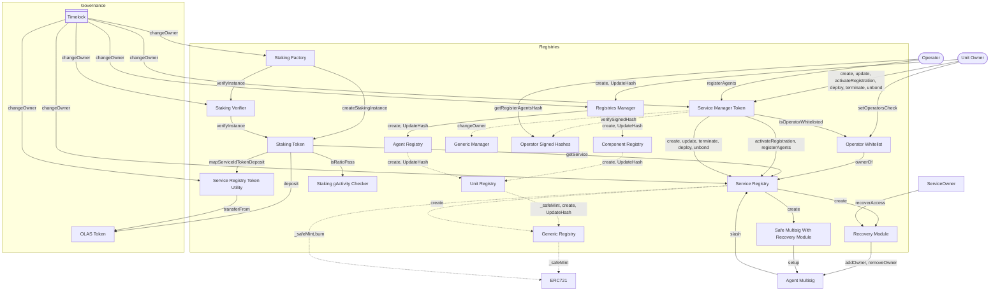

# Registries Flowchart

```mermaid
graph TD
    %% Agent/Component/Service
    subgraph registries [Registries]
    AgentRegistry[Agent Registry]
    ComponentRegistry[Component Registry]
    GenericManager[Generic Manager]
    ServiceRegistry[Service Registry]
    GenericRegistry[Generic Registry]
    OperatorSignedHashes[Operator Signed Hashes]
    OperatorWhitelist[Operator Whitelist]
    RecoveryModule[Recovery Module]
    RegistriesManager[Registries Manager]
    SafeMultisigWithRecoveryModule[Safe Multisig With Recovery Module]
    ServiceRegistryTokenUtility[Service Registry Token Utility]
    ServiceManagerToken[Service Manager Token]
    StakingActivityChecker[Staking gActivity Checker]
    StakingToken[Staking Token]
    StakingFactory[Staking Factory]
    StakingVerifier[Staking Verifier]
    UnitRegistry[Unit Registry]
    end
    
    subgraph governance [Governance]
    OLAS_Token[OLAS Token]
    Timelock@{ shape: div-rect, label: "Timelock" }
    end
    
    AgentMultisig[Agent Multisig]
    Operator([Operator])
    UnitOwner([Unit Owner])
    
    UnitOwner -->|create, UpdateHash| RegistriesManager
    RegistriesManager -->|create, UpdateHash| AgentRegistry
    RegistriesManager -->|create, UpdateHash| ComponentRegistry
    ComponentRegistry -.->|create, UpdateHash| UnitRegistry
    AgentRegistry -.->|create, UpdateHash| UnitRegistry
    UnitRegistry -.->|_safeMint, create, UpdateHash| GenericRegistry
    GenericRegistry -.->|_safeMint|ERC721
    UnitOwner -->|setOperatorsCheck|OperatorWhitelist
    OperatorWhitelist-->|ownerOf|ServiceRegistry
    AgentMultisig-->|slash|ServiceRegistry
    ServiceRegistry-.->|create|GenericRegistry
    ServiceRegistry-->|create|SafeMultisigWithRecoveryModule
    ServiceRegistry-->|create|RecoveryModule
    ServiceOwner-->|recoverAccess|RecoveryModule
    RecoveryModule-->|addOwner, removeOwner|AgentMultisig
    SafeMultisigWithRecoveryModule-->|setup|AgentMultisig
    StakingToken-->|mapServiceIdTokenDeposit|ServiceRegistryTokenUtility
    StakingToken-->|getService|ServiceRegistry
    StakingToken-->|isRatioPass|StakingActivityChecker
    StakingToken-->|deposit|OLAS_Token
    StakingFactory-->|verifyInstance|StakingVerifier
    StakingFactory-->|createStakingInstance|StakingToken
    StakingVerifier-->|verifyInstance|StakingToken
    ServiceRegistry-.->|_safeMint,burn|ERC721
    ServiceRegistryTokenUtility-->|transferFrom|OLAS_Token
    ServiceManagerToken-->|activateRegistration, registerAgents|ServiceRegistry
    ServiceManagerToken-->|create, update, terminate, deploy, unbond|ServiceRegistry
    ServiceManagerToken-->|isOperatorWhitelisted|OperatorWhitelist
    ServiceManagerToken-.->|verifySignedHash|OperatorSignedHashes
    UnitOwner-->|create, update, activateRegistration, deploy, terminate, unbond|ServiceManagerToken
    Operator-->|registerAgents|ServiceManagerToken
    Operator-->|getRegisterAgentsHash|OperatorSignedHashes
    Timelock-->|changeOwner|RegistriesManager
    Timelock-->|changeOwner|ServiceManagerToken
    Timelock-->|changeOwner|ServiceRegistry
    Timelock-->|changeOwner|ServiceRegistryTokenUtility
    Timelock-->|changeOwner|StakingFactory
    Timelock-->|changeOwner|StakingVerifier
    ServiceManagerToken-.->|changeOwner|GenericManager
```
